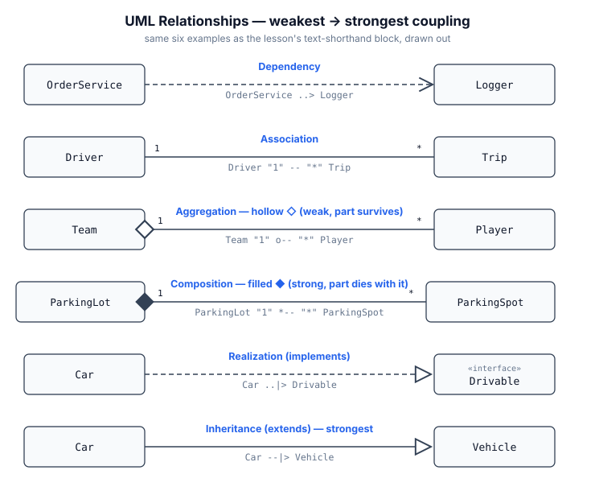

# Lesson 3 — UML Class Diagram Notation (Interview Depth)

_Crazy-notes version. Scope: nobody expects a polished UML-tool diagram in an interview. What's expected is sketching the same information fast — whiteboard, shared doc, or narrated aloud — with consistent shorthand._

## The class box

Three compartments: name / attributes / methods.
- `+` public, `-` private, `#` protected, `~` package-private
- *italics* = abstract (class or method)
- underline = static
- `«interface»` stereotype above the name marks an interface

## The six relationships — ranked weakest → strongest coupling

The ranking itself is the interview-useful part: when asked "how would you model X and Y," you're picking a point on this scale.

| Relationship | Line | Meaning | Example |
|---|---|---|---|
| Dependency | `..>` dashed, open arrow | "uses temporarily" — parameter/local var, not a stored field | `OrderService ..> Logger` |
| Association | `--` / `-->` plain line | general "has a reference to," stored, bidirectional or one-way | `Driver -- Trip` |
| Aggregation | `--o` hollow diamond | HAS-A, part can outlive the whole — weak ownership | `Team o-- Player` |
| Composition | `--*` filled diamond | HAS-A, part's lifecycle bound to the whole — strong ownership | `ParkingLot *-- ParkingSpot` |
| Realization | `..|>` dashed, hollow triangle | implements an interface | `Car ..|> Drivable` |
| Inheritance | `--|>` solid, hollow triangle | IS-A, extends a class | `Car --|> Vehicle` |

**Aggregation vs composition test**: does the part's lifecycle depend on the whole's? Delete a `Team` → `Player`s still exist, can transfer elsewhere (aggregation). Delete a `ParkingLot` → its `ParkingSpot`s cease to make sense independently (composition).

## Naming trap — flag this explicitly in interviews

UML "composition" (the ◆ ownership relationship above) and "favor composition over inheritance" ([[01_oop_pillars]] design principle — `Duck` HAS-A `FlyBehavior`) are **the same word for a related but distinct idea**. The design-principle sense usually maps to *aggregation or plain association* in practice — a `Duck` doesn't own its `FlyBehavior`'s lifecycle the way a `ParkingLot` owns its `ParkingSpot`s; the behavior can be swapped at runtime. Don't conflate the two out loud.

## Multiplicity

At each end of an association: `1`, `0..1`, `*` (or `0..*`), `1..*`, or an exact range (`2..4`). `Driver "1" -- "*" Trip` = "one driver has many trips."

## Text shorthand (what you actually write live)

```
Car --|> Vehicle                      // inheritance
Car ..|> Drivable                      // realization/implements
ParkingLot "1" *-- "*" ParkingSpot     // composition, 1 lot : many spots
Team "1" o-- "*" Player                // aggregation
Driver "1" -- "*" Trip                 // association
OrderService ..> Logger                // dependency
```
Matches PlantUML syntax closely — usable directly if a company's tooling renders it, legible enough to hand-write or type in a plain text box otherwise.

## The same six examples, drawn out

The text shorthand above compresses well but is easy to mentally blur across the four "line + end-marker" relationships. Here's the same six as an actual diagram — same names, same order, weakest to strongest top to bottom:



## Self-check questions

Try answering these from memory before reading the answers below.

- Can you state the aggregation-vs-composition test in one sentence, with an example for each?
- Can you explain why UML composition ≠ "composition over inheritance," without hand-waving?
- Given two classes in a scenario, can you justify which of the 6 relationships fits, not just name one?
- Can you place all 6 relationships on the weakest→strongest coupling scale from memory?

## Self-check answers

**1. The aggregation-vs-composition test, with an example for each.**
The test: does the part's lifecycle depend on the whole's — if the whole is deleted, does the part still make sense on its own? Aggregation example: delete a `Team`, its `Player`s still exist and can join another team. Composition example: delete a `ParkingLot`, its `ParkingSpot`s cease to make sense independently and are deleted with it.

**2. Why UML composition ≠ "composition over inheritance."**
UML composition is specifically the strong-ownership relationship (filled diamond) where the part's lifecycle is bound to the whole's — e.g. `ParkingLot`/`ParkingSpot`. "Favor composition over inheritance" is a design principle about using *any* held reference instead of class inheritance to get reuse and flexibility — e.g. `Duck` HAS-A `FlyBehavior`. That HAS-A is usually just aggregation or plain association in UML terms, not UML composition, because the held object doesn't have its lifecycle bound to the owner — a `FlyBehavior` can be swapped at runtime, created independently, shared across multiple `Duck`s. Both share a HAS-A shape; they differ on strictness. UML composition requires ownership *and* lifecycle binding; the design-principle sense only requires "holds a reference to, rather than extends."

**3. Justifying which of the 6 fits a given pair — the process, not a fixed answer.**
Run the same decision tree every time: (1) is one a *kind of* the other? → inheritance if the parent is a class, realization if it's an interface. (2) If not, does one hold the other as stored state, or just use it briefly? → briefly (a parameter/local variable, never stored) is dependency. (3) If stored, does the held object's lifecycle depend on the holder? → yes is composition, no-but-still-a-whole/part-relationship is aggregation, no-whole/part-relationship-at-all is plain association. Saying "why" out loud means walking this tree to one relationship with a one-sentence justification — e.g. *"`OrderService` uses `Logger` only inside one method call and never stores it, so dependency."*

**4. The weakest→strongest scale, from memory.**
Dependency (weakest) → Association → Aggregation → Composition → Realization → Inheritance (strongest). The first four are about how tightly one object's *reference* to another is bound (from "borrowed for one call" up to "owns its lifecycle"). The last two are a different kind of coupling entirely — committing to another type's whole contract, not just holding a reference to it — which is why they rank above even composition: realization commits to an interface's contract, inheritance commits to a concrete class's entire implementation and contract.

## Exercise — done
Sketch a text-notation class diagram for a small Library Management System scenario → `solutions/lesson3_uml.md`. First pass mixed up IS-A/HAS-A (aggregation instead of inheritance for Person→Member/Librarian) and had the aggregation/composition diamonds swapped for Library↔Book and Library↔Librarian — both corrected in the solution file, with the lifecycle test applied explicitly to each one.
